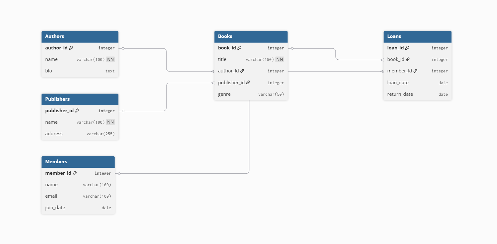

# Library Management Database

## Overview
This task involves designing a relational database for a library system. It includes entities such as books, authors, publishers, members, and loans.

## Tools Used
- MySQL Workbench for schema design and ER diagram
- SQL for creating tables and defining relationships

## Schema Highlights
- Uses `AUTO_INCREMENT` for surrogate keys
- Relationships modeled with foreign keys
- Normalized design to avoid redundancy

## ER Diagram

## Interview Prep
Check `interview_questions.txt` for commonly asked DBMS questions.
